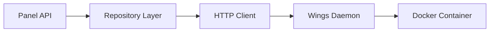

# Source Code References

Most API endpoints documented in this guide includes references to the actual implementation in the Pterodactyl Panel source code. This helps developers understand how the API works internally and provides a way to verify the accuracy of our documentation.

## How to Use Source References

### 📂 **Repository Structure**

The Pterodactyl Panel is open source and available on GitHub:
- **Main Repository**: [pterodactyl/panel](https://github.com/pterodactyl/panel)
- **Wings Daemon**: [pterodactyl/wings](https://github.com/pterodactyl/wings)

### 🗂️ **Key Directories**

| Directory | Purpose | Contains |
|-----------|---------|----------|
| [`app/Http/Controllers/Api/Client/`](https://github.com/pterodactyl/panel/tree/1.0-develop/app/Http/Controllers/Api/Client) | Client API Controllers | User-facing server management endpoints |
| [`app/Http/Controllers/Api/Application/`](https://github.com/pterodactyl/panel/tree/1.0-develop/app/Http/Controllers/Api/Application) | Application API Controllers | Administrative panel management endpoints |
| [`routes/api-client.php`](https://github.com/pterodactyl/panel/blob/1.0-develop/routes/api-client.php) | Client API Routes | Route definitions for client endpoints |
| [`routes/api-application.php`](https://github.com/pterodactyl/panel/blob/1.0-develop/routes/api-application.php) | Application API Routes | Route definitions for admin endpoints |
| [`app/Models/`](https://github.com/pterodactyl/panel/tree/1.0-develop/app/Models) | Data Models | Database models and relationships |
| [`app/Services/`](https://github.com/pterodactyl/panel/tree/1.0-develop/app/Services) | Business Logic | Complex operations and business rules |

## Understanding Source References

### 📍 **Reference Format**

Each endpoint includes these source references:

```markdown
### Source Reference
- **Method**: [`ControllerName@methodName`](link-to-github)
- **Route**: [`HTTP_METHOD /api/path`](link-to-route-definition)
- **Service**: [`ServiceClassName`](link-to-service-class)
```

### 🎯 **Example Breakdown**

For the "List Users" endpoint:

```markdown
### Source Reference
- **Method**: [`UserController@index`](https://github.com/pterodactyl/panel/blob/1.0-develop/app/Http/Controllers/Api/Application/Users/UserController.php#L47)
- **Route**: [`GET /api/application/users`](https://github.com/pterodactyl/panel/blob/1.0-develop/routes/api-application.php#L45)
```

This tells you:
- **Controller Method**: The `index` method in `UserController` handles this request
- **Route Definition**: Line 45 in `api-application.php` defines this route
- **GitHub Links**: Direct links to the exact lines of code

## API Implementation Patterns

### 🔄 **Common Controller Methods**

| Method | Purpose | HTTP Verb |
|--------|---------|-----------|
| `index` | List resources | GET |
| `show` / `view` | Get single resource | GET |
| `store` | Create new resource | POST |
| `update` | Update existing resource | PATCH/PUT |
| `destroy` / `delete` | Delete resource | DELETE |

### 🛡️ **Authentication & Middleware**

All API endpoints use these middleware components:

- **Client API**: [`Client Middleware`](https://github.com/pterodactyl/panel/tree/1.0-develop/app/Http/Middleware/Api/Client)
- **Application API**: [`AuthenticateApplicationUser`](https://github.com/pterodactyl/panel/blob/1.0-develop/app/Http/Middleware/Api/Application/AuthenticateApplicationUser.php)
- **Server Access**: [`AuthenticateServerAccess`](https://github.com/pterodactyl/panel/blob/1.0-develop/app/Http/Middleware/Api/Client/Server/AuthenticateServerAccess.php)

### 🔧 **Service Layer Pattern**

Complex operations are handled by service classes:

- **User Management**: [`UserCreationService`](https://github.com/pterodactyl/panel/blob/1.0-develop/app/Services/Users/UserCreationService.php)
- **Server Creation**: [`ServerCreationService`](https://github.com/pterodactyl/panel/blob/1.0-develop/app/Services/Servers/ServerCreationService.php)
- **Power Management**: [`DaemonPowerRepository`](https://github.com/pterodactyl/panel/blob/1.0-develop/app/Repositories/Wings/DaemonPowerRepository.php)

## Wings Daemon Integration

### 🚀 **Wings Communication**

Many endpoints communicate with the Wings daemon:

- **Wings Repository**: [pterodactyl/wings](https://github.com/pterodactyl/wings)
- **WebSocket Handling**: [`websocket.go`](https://github.com/pterodactyl/wings/blob/develop/router/websocket/websocket.go)
- **Server Management**: [`server.go`](https://github.com/pterodactyl/wings/blob/develop/server/server.go)
- **File Operations**: [`Wings Server Code`](https://github.com/pterodactyl/wings/tree/develop/server)

### 🔗 **Panel-Wings Communication**



## Quick Reference Links

### 📋 **Client API Controllers**

| Feature | Controller | GitHub Link |
|---------|------------|-------------|
| Server List | `ClientController` | [View Code](https://github.com/pterodactyl/panel/blob/1.0-develop/app/Http/Controllers/Api/Client/ClientController.php) |
| Server Details | `ServerController` | [View Code](https://github.com/pterodactyl/panel/blob/1.0-develop/app/Http/Controllers/Api/Client/Servers/ServerController.php) |
| Power Management | `PowerController` | [View Code](https://github.com/pterodactyl/panel/blob/1.0-develop/app/Http/Controllers/Api/Client/Servers/PowerController.php) |
| File Management | `FileController` | [View Code](https://github.com/pterodactyl/panel/blob/1.0-develop/app/Http/Controllers/Api/Client/Servers/FileController.php) |
| Database Management | `DatabaseController` | [View Code](https://github.com/pterodactyl/panel/blob/1.0-develop/app/Http/Controllers/Api/Client/Servers/DatabaseController.php) |
| Backup Management | `BackupController` | [View Code](https://github.com/pterodactyl/panel/blob/1.0-develop/app/Http/Controllers/Api/Client/Servers/BackupController.php) |

### 🔧 **Application API Controllers**

| Feature | Controller | GitHub Link |
|---------|------------|-------------|
| User Management | `UserController` | [View Code](https://github.com/pterodactyl/panel/blob/1.0-develop/app/Http/Controllers/Api/Application/Users/UserController.php) |
| Server Management | `ServerController` | [View Code](https://github.com/pterodactyl/panel/blob/1.0-develop/app/Http/Controllers/Api/Application/Servers/ServerController.php) |
| Node Management | `NodeController` | [View Code](https://github.com/pterodactyl/panel/blob/1.0-develop/app/Http/Controllers/Api/Application/Nodes/NodeController.php) |
| Location Management | `LocationController` | [View Code](https://github.com/pterodactyl/panel/blob/1.0-develop/app/Http/Controllers/Api/Application/Locations/LocationController.php) |

## Contributing to Pterodactyl

### 🤝 **How to Contribute**

If you find issues or want to improve the Panel:

1. **Report Issues**: [Panel Issues](https://github.com/pterodactyl/panel/issues)
2. **Submit Pull Requests**: [Contributing Guide](https://github.com/pterodactyl/panel/blob/1.0-develop/CONTRIBUTING.md)
3. **Join Discord**: [Pterodactyl Community](https://discord.gg/pterodactyl)

### 📚 **Development Setup**

- **Installation Guide**: [Panel Installation](https://pterodactyl.io/panel/1.0/getting_started.html)
- **Development Environment**: [Development Setup](https://github.com/pterodactyl/panel/blob/1.0-develop/CONTRIBUTING.md#development-environment)
- **API Documentation**: [Official API Docs](https://dashflo.net/docs/api/pterodactyl/v1/)

## Version Information

### 📅 **Current References**

All source references in this documentation point to:
- **Branch**: `1.0-develop` (Pterodactyl v1 stable development branch)
- **Panel Version**: v1.11.x
- **Wings Version**: v1.11.x

### ⚠️ **Version Notes**

- Links point to the `develop` branch for the latest features
- For stable releases, change `develop` to the specific version tag (e.g., `v1.11.5`)
- Some features may only be available in newer versions

## Related Documentation

- **[Authentication](./authentication)** - API key setup and usage
- **[Rate Limiting](./rate-limiting)** - Request limits and best practices
- **[Error Handling](./error-handling)** - Common errors and solutions
- **[Client API](./api/client)** - User-facing endpoints
- **[Application API](./api/application)** - Administrative endpoints
- **[WebSocket API](./api/websocket)** - Real-time communication 